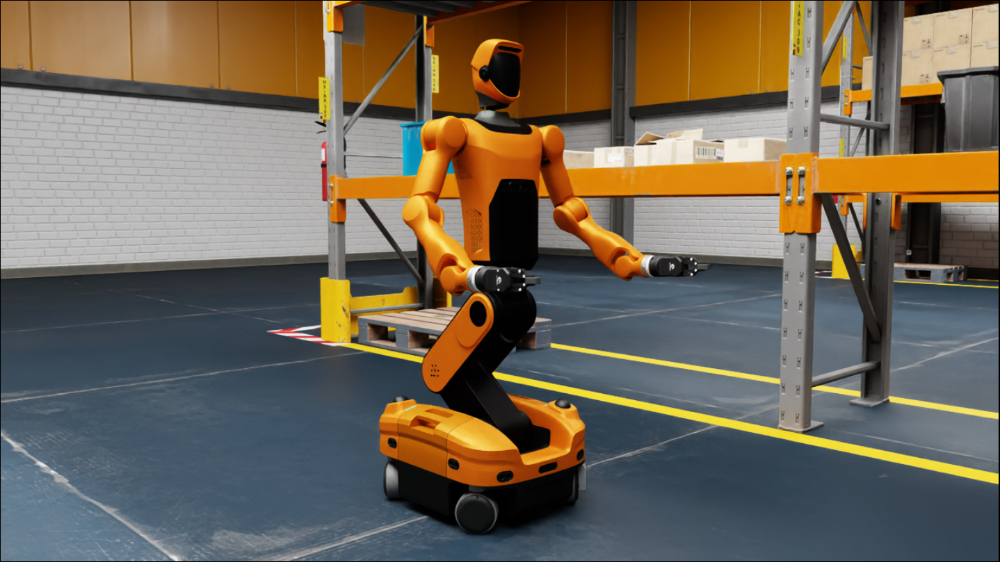
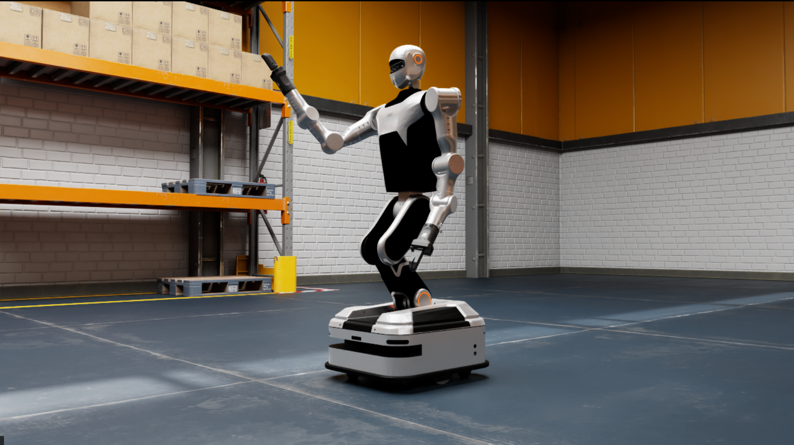

# FiveAges Sim&Control

  

## For ROS2 Developers
* [Robot Descriptions](https://github.com/fiveages-sim/robot_descriptions)

    

    
<strong>Descriptions deployed on real robot</strong>

    
    * [Dobot CR Series](https://github.com/fiveages-sim/robot-descriptions-dobot)
    * [Rokae AR Series](https://github.com/fiveages-sim/robot-descriptions-rokae)
    * [Tianji Marvin Series](https://github.com/fiveages-sim/robot-descriptions-tianji)
    * [FiveAges W1](https://github.com/fiveages-sim/fa-w1-description)
    * [FiveAges W2](https://github.com/fiveages-sim/fa-w2-description)
    * [ARX X5&AC-One](https://github.com/fiveages-sim/robot-descriptions-arx)
    
    

* [Arms ROS2 Control](https://github.com/fiveages-sim/arms_ros2_control)

    

    
<strong>ROS2 Control Hardware Interfaces</strong>

    
    * [Dobot CR Series](https://github.com/fiveages-sim/dobot-cr-ros2-control)
    * [Rokae AR Series](https://github.com/fiveages-sim/rokae-ros2-control)
    * [Tianji Marvin Series](https://github.com/fiveages-sim/marvin-ros2-control)
    * [Eyou Motors](https://github.com/fiveages-sim/eyou-ros2-control)
    * [Juxie Motors](https://github.com/fiveages-sim/juxie-ros2-control)
    * [Modbus RTU](https://github.com/fiveages-sim/modbus-ros2-control)
    * [Unitree Humannoid](https://github.com/fiveages-sim/unitree-ros2-control)
    * [ARX X5](https://github.com/fiveages-sim/arx-ros2-control)
    
    

## Quick Deploy
### ROS2 Workspace
* [cr5-deploy-ws](https://github.com/fiveages-sim/cr5-deploy-ws)
* [fa-deploy-ws](https://github.com/fiveages-sim/fa-deploy-ws)
### Conda Env
* [fa-py-libraries](https://github.com/fiveages-sim/fa-py-libraries)

## Python Tools
* [ROS2 Interface](https://github.com/fiveages-sim/ros2_robot_interface)
* [Viser GUI](https://github.com/fiveages-sim/ros2-viser)
* [VR Teleop](https://github.com/fiveages-sim/vr_pose_publisher)
* [Lerobot ROS2](https://github.com/fiveages-sim/lerobot_ros2)
* [Gym Hil](https://github.com/fiveages-sim/gym-hil)

## Simulation

### Isaac Sim
* [Robot USDs](https://github.com/fiveages-sim/robot_usds)
* [Env USDs](https://github.com/fiveages-sim/fiveages-env-usds)
* [FiveAges W1 USD](https://github.com/fiveages-sim/fa-w1-usds)
* [FiveAges W2 USD](https://github.com/fiveages-sim/fa-w2-usds)

### ManiSkill
* [ManiSkill Models](https://github.com/fiveages-sim/maniskill_models)

### RoboSuite (Mujoco)
* [RoboSuite Models](https://github.com/fiveages-sim/robosuite_models)